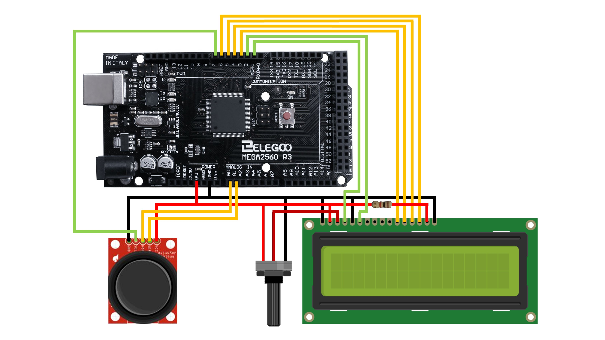

# LCD-Asteroid-Shooter-Game

## Table of Contents
- [Description](#Description)
- [Prerequisites](#Prerequisites)
- [How to Use](#How-to-Use)
- [Helpful Links](#Helpful-Links)

<br/>

## Description
This was my first venture into programming the Arduino LCD. The game allows the player to move around the screen to avoid asteroids or shoot them by clicking the joystick. It uses no special characters or libraries except for ***LiquidCrystal***, which comes with the Arduino IDE.

If you would like to see a more complex LCD project, see [LCD Koi Fish][10].

To see the Asteroid Shooter in action, see the video below!

<br/>

[](https://youtu.be/BRkThhRWufc)

<br/>

## Prerequisites
In order to build one for yourself, you should have access to the following items:
- [Arduino Microcontroller][1]
- [LCD and Joystick][2]
- [Arduino IDE][3]

<br/>

## How to Use
This project uses an Arduino MEGA with an attached [joystick][5] and [Liquid Crystal Display][4] (click on the links for tutorials). 

Wire your project according to the diagram below. The little black rod attached to the LCD is a potentiometer, which is used to regulate the brightness/contrast of the screen.

<br/>



<br/>

Once your project is wired, connect your Arduino microcontroller to your computer, open ***src/AsteroidShooter/AsteroidShooter.ino*** with the Arduino IDE, and upload the project.

If you have wired pins differently, make sure to reflect those changes in the code.
```cpp
const int rs = 1, 
en = 2, 
d4 = 3, 
d5 = 4, 
d6 = 5, 
d7 = 6, 
sw = 7, 
xPin = A0, 
yPin = A1;
```

If you are unable to upload the program to your board, make sure you select the correct ***Board*** and ***Port*** under ***Tools*** in the Arduino IDE.

<br/>

## Helpful Links
[LCD Tutorial][4]

[Joystick Tutorial][5]


[1]: https://store.arduino.cc/usa/mega-2560-r3
[2]: https://www.amazon.com/ELEGOO-Upgraded-Tutorial-Compatible-MEGA2560/dp/B01MG49ZQ5/ref=pd_sbs_147_img_1/137-9343435-9781537?_encoding=UTF8&pd_rd_i=B01MG49ZQ5&pd_rd_r=015e7469-253e-44bf-992d-c821a0dbdd71&pd_rd_w=QBO6t&pd_rd_wg=AVDBZ&pf_rd_p=5cfcfe89-300f-47d2-b1ad-a4e27203a02a&pf_rd_r=69BPHVW21DAD759CPNC9&psc=1&refRID=69BPHVW21DAD759CPNC9
[3]: https://www.arduino.cc/en/main/software
[4]: https://howtomechatronics.com/tutorials/arduino/lcd-tutorial/
[5]: https://www.brainy-bits.com/arduino-joystick-tutorial/

[10]: https://github.com/Vladnet47/LCD-Koi-Fish